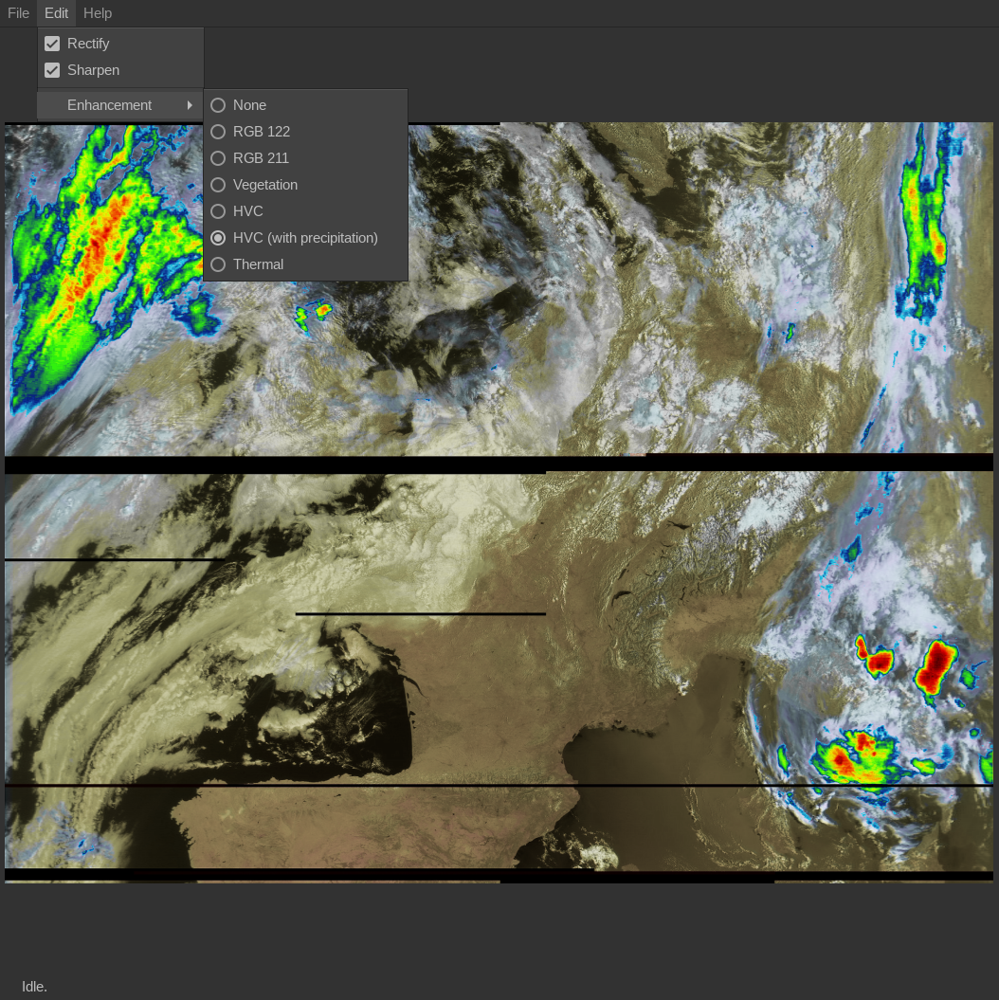

LRPT image postprocessor
========================

This is a free, open-source LRPT image postprocessor. It can load a raw RGB
image to produce false-color composites.

Features:
- Rectification (Earth curvature correction)
- Sharpening
- Color composites:
	* RGB 122 (natural colors)
	* RGB 211 (red = vegetation)
	* Vegetation (green = vegetation)
	* HVC false color (colorize visible channel based on temperature)
	* HVC w/ precipitation (same as above, with precipitation highlighted)
	* Thermal




Build/install instructions
--------------------------

```
mkdir build && cd build
cmake ..
make
sudo make install
```

Requires the following libraries: GTK+3, GLib
